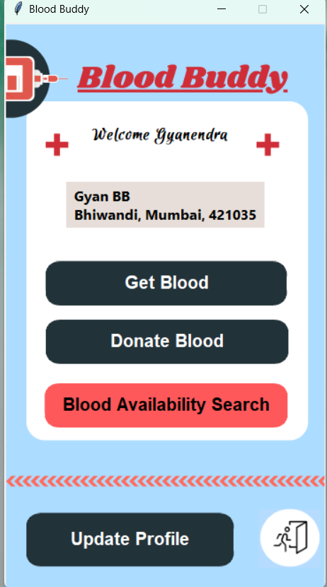

# Blood Buddy : Blood Bank Recommendation System

This is a mini project for the Python and Database Management System subject. It is a two-sided application, with a blood bank side and a user side.

## Screenshots

### Blood bank Side

### User Side

## Features

1. The application recommends users the blood bank based on blood availability, location, blood group and whether the user wants to donate or get blood.
2. The application provides complete details of the blood bank, such as its address, contact information, and the types of blood it has in stock.
3. On the blood bank side, blood banks can update the quantity of each blood group.
4. User and Blood Bank both has Login and signup feature.

Note:
This is not a real application hosted on the cloud. It is just a project for educational purposes.

## Requirements

1. MySQL server with suitable tables made as specified in the program.
2. Python 3.x
3. Tkinter package
4. customTkinter package

## Usage

To run the application, first create a MySQL database and tables as specified in the program. Then, install the required Python packages and run the bb_side.py or user_side.py file.

## Authors

This project was made by a group of 4 people:

Gyanendra Tiwari,
Manali Desai,
Maitreyee Jadhav,
Raghav Bhandari
